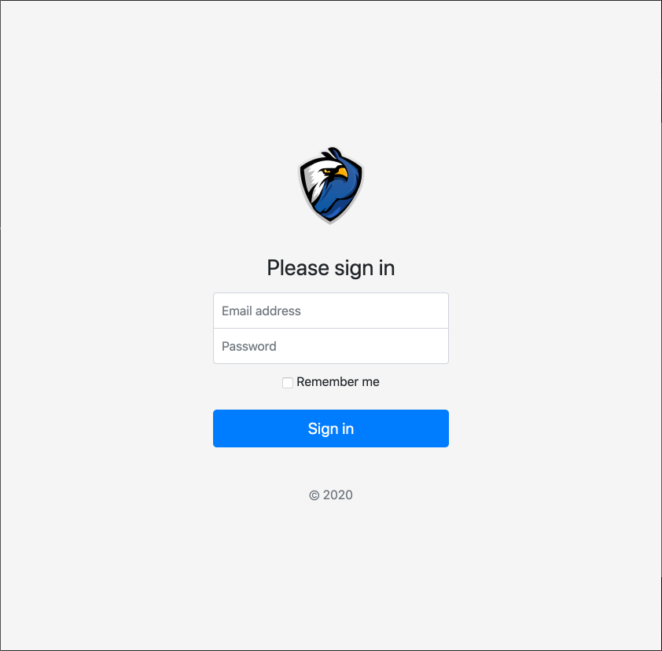
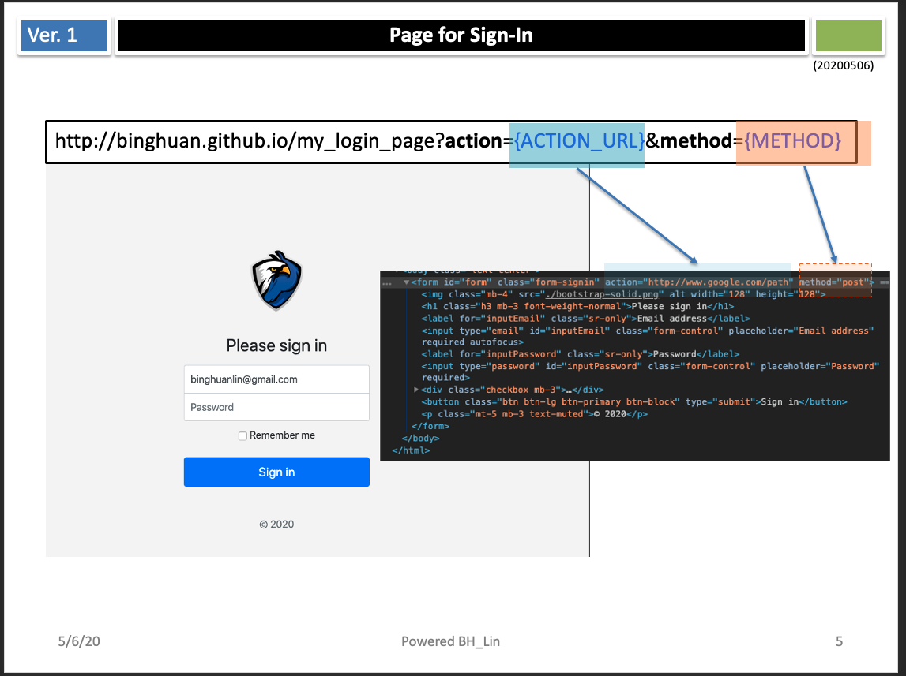

# My Login Page

A comprehensive web-based authentication system built with Bootstrap and vanilla JavaScript, featuring JWT token management and browser extension integration.

**Live Demo:** <https://binghuan.github.io/my_login_page/>

## Illustration


## Features

- 🔐 **Secure Login Form** - Bootstrap-styled login interface with email/password authentication
- 🔄 **Automatic Token Refresh** - Seamless JWT token renewal when expired
- 💾 **Remember Me** - Saves credentials in localStorage for user convenience
- ✅ **Login Status Feedback** - Visual success/failure indicators with toast notifications
- 🚪 **Logout Management** - Complete session cleanup and token invalidation
- 🔌 **API Testing Interface** - Built-in tool for testing authenticated API calls
- 📱 **Responsive Design** - Mobile-friendly Bootstrap-based UI
- 🎨 **Custom Styling** - Professional signin form with smooth animations

## Project Structure

```
my_login_page/
├── index.html          # Main login page
├── index.js            # Login form logic and token refresh
├── result.html         # Login result status page
├── result.js           # Result processing and JWT handling
├── profile.html        # User welcome/profile page
├── token.html          # API testing interface
├── token.js            # API request functionality
├── logout.html         # Logout confirmation page
├── logout.js           # Logout processing
├── utils.js            # Utility functions (cookies, URL params)
├── signin.css          # Custom styling for forms
├── bootstrap.min.css   # Bootstrap CSS framework
├── images/             # UI icons and assets
│   ├── ok.svg         # Success icon
│   ├── fail.svg       # Failure icon
│   ├── exit.svg       # Logout icon
│   ├── social.svg     # Profile/welcome icon
│   └── progress.gif   # Loading animation
└── token.json          # Sample token structure
```

## How to Use



### 1. **Login Process**
- Navigate to `index.html`
- Enter your email and password
- Optionally check "Remember me" to save credentials
- Click "Sign in" to authenticate

### 2. **Token Management** 
- Successful login redirects to `result.html` with token display
- Failed login shows error status
- Tokens are automatically refreshed when expired
- JWT tokens are stored in cookies for session management

### 3. **API Testing**
- Use `token.html` to test authenticated API endpoints
- Enter API URL and click "GET" to make requests
- Response data is displayed in formatted JSON

### 4. **Logout**
- Access `logout.html` to end session
- Tokens are cleared from cookies
- User is signed out from browser extension

## Technical Details

### Dependencies
- **Bootstrap 4.5.0** - UI framework and components
- **jQuery 3.5.1** - DOM manipulation and AJAX
- **Popper.js 1.16.0** - Tooltip and popover positioning

### Browser Extension Integration
The system integrates with a browser extension API (`beaker://enmabrowser.api/`) for:
- Token transmission (`/send` endpoint)
- Logout processing (`/logout` endpoint)

### Local Storage Usage
- `localStorage.account` - Saved username/email
- `localStorage.password` - Saved password (when "Remember me" is checked)
- `localStorage.inputURL` - Last used API testing URL

### Cookie Management
- `token` cookie stores JWT access token
- Automatic expiration handling
- Secure token cleanup on logout

## Key Features Implementation

### Automatic Token Refresh
When a token expires, the system:
1. Detects expired status via URL parameter
2. Shows loading animation
3. Automatically resubmits credentials
4. Updates token without user intervention

### Form Persistence
- Credentials are saved in localStorage when "Remember me" is checked
- Form automatically populates saved credentials on page load
- Smooth fade-in animation for better UX

### Status Feedback
- Visual icons (✅ success, ❌ failure, 🚪 logout)
- Color-coded status messages
- Bootstrap toast notifications for token creation
- Real-time timestamp updates

## Browser Compatibility
- Modern browsers with ES6+ support
- Responsive design works on mobile devices
- Requires CORS support for API integration

## Security Considerations
- Passwords stored in localStorage (consider encryption for production)
- JWT tokens handled via secure cookies
- CORS-enabled API requests
- Automatic token cleanup on logout

## Development
This is a client-side only application - no backend server required. Simply host the files on any web server or GitHub Pages for immediate deployment.